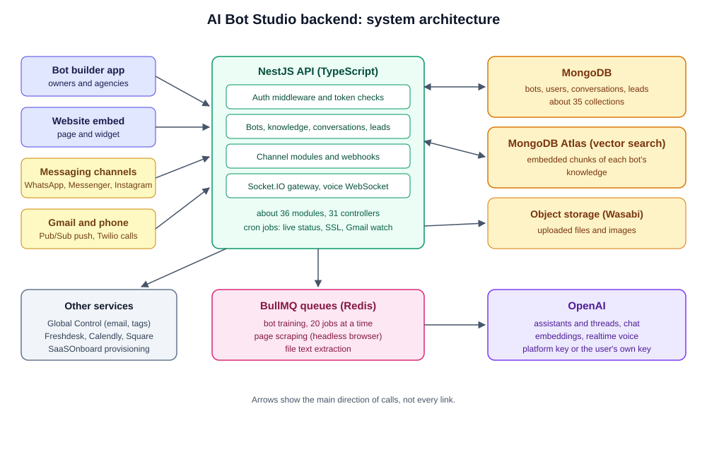
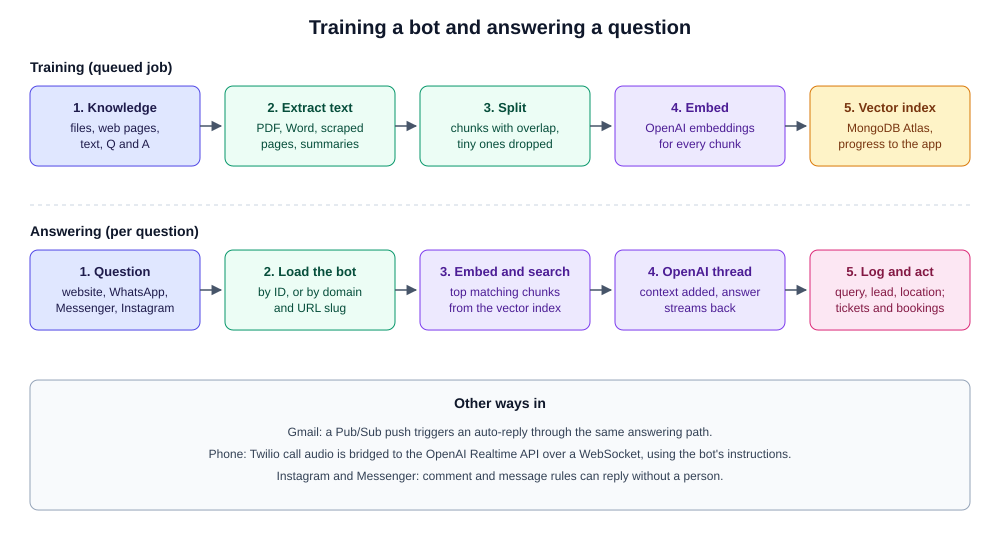
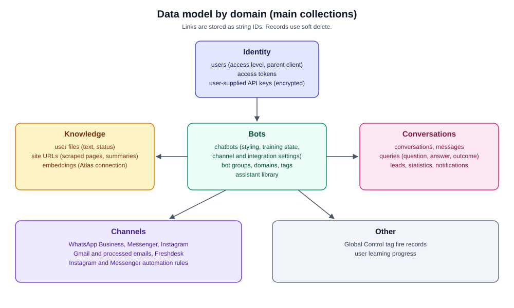

# AI Bot Studio Backend

Documentation for the backend of AI Bot Studio, a platform for building AI chat bots that answer from a business's own content and talk to customers on a website, WhatsApp, Messenger, Instagram, Gmail and by phone. The apps that use this API are documented in [AI-Bot-Studio-Frontend](https://github.com/jsoftsol/AI-Bot-Studio-Frontend) (the builder) and [AI-Bot-Studio-Public](https://github.com/jsoftsol/AI-Bot-Studio-Public) (the visitor chat and embeddable widget).

> **The source code is not included in this repository.** This is client work and the code is proprietary. This repo only holds documentation: this README, a reverse-engineered product spec ([PRD.md](PRD.md)), and three diagrams in `screenshots/`. Everything here was written from a read-through of the actual codebase. Credentials, hostnames and security specifics are left out on purpose.

## What it does

A user creates a bot, gives it knowledge (uploaded files, web pages, free text, question and answer pairs), trains it, and then puts it in front of customers. The bot answers from that knowledge using OpenAI models. Conversations, leads and questions are stored so the owner can review them. Agencies can manage bots for their own clients under one account.

## Architecture

- **API.** NestJS 10 on Express, written in TypeScript. About 36 modules, 31 controllers and 270 route definitions. Layering is controller, service, Mongoose model.
- **Authentication.** Email and password with signed tokens. Each token is also stored in the database so it can be revoked. A separate long-lived API token exists per user. Agencies can act as a client account through a second header.
- **Queues.** BullMQ on Redis runs three jobs: bot training, web page scraping and file text extraction.
- **Scheduled jobs.** Live conversation status every 10 minutes, custom-domain SSL status every 5 minutes, and a daily renewal of Gmail watches.
- **Realtime.** Socket.IO pushes training progress, notifications and live conversation state. Voice calls use a separate WebSocket server that bridges Twilio media streams to the OpenAI Realtime API.
- **Storage.** MongoDB for application data, a second MongoDB Atlas connection that holds the vector embeddings, and Wasabi (S3-compatible) object storage for files and images.
- **Bring your own key.** Users can store their own OpenAI key, kept encrypted. Bots without one use the platform's key.

### How a bot answers

## Tech stack

| Area | Tools |
|---|---|
| Runtime | Node.js 20, TypeScript 5 |
| Framework | NestJS 10, Express |
| Database | MongoDB with Mongoose 8, MongoDB Atlas vector search |
| Queues and jobs | BullMQ on Redis, `@nestjs/schedule` |
| Realtime | Socket.IO, `ws` |
| AI | OpenAI SDK: Assistants API with threads, chat, embeddings, Realtime voice |
| Document handling | LangChain text splitters, tiktoken, pdfreader, word-extractor, html-to-text |
| Web scraping | Puppeteer with the stealth plugin |
| Channels | Meta Graph API (WhatsApp Business, Messenger, Instagram), Gmail API with Pub/Sub, Twilio voice |
| Storage | Wasabi through the AWS SDK |
| Operations | pm2, with separate dev and production processes |

## Core features

- **Bot builder.** Name, instructions, model choice, page and popup styling, welcome gate that collects lead details, call-to-action, quick answers, groups, tags and custom domains with URL slugs.
- **Knowledge ingestion.** Uploaded PDF, Word and text files, scraped web pages with summaries, free text and question and answer pairs. Content is split into chunks, embedded and stored in a vector index.
- **Answering.** Each question is embedded, matched against the bot's vector index, and the best passages are added to an OpenAI thread before the answer streams back. Conversation memory lives in the thread.
- **Function calling.** Bots can create Freshdesk tickets and book appointments through Calendly or Square.
- **Instruction generator.** Builds a bot's instructions from a topic, tone, keywords and persona.
- **Channels.**
  - Website embed (full page and widget).
  - WhatsApp Business, Facebook Messenger and Instagram direct messages.
  - Instagram and Messenger comment and message automations.
  - Gmail auto-replies.
  - Phone calls with a voice bot.
- **Leads and conversations.** Lead capture with location data, conversation history, top conversations and a percentage-of-activity view.
- **Assistant library.** Reusable OpenAI assistant configurations.
- **Agency accounts.** Sub-client accounts with login-as-client.
- **Integrations.** Global Control for email sending and tag firing (see [Global-Control-Server](https://github.com/jsoftsol/Global-Control-Server)), and SaaSOnboard for user provisioning.

## Data model

Roughly 35 MongoDB collections. Links between records are stored as string IDs, and records use soft delete.

- **Identity:** users (with an access level and an optional parent for agency clients), access tokens, user-supplied API keys.
- **Bots:** chatbots (one large document with styling, knowledge references, training state and channel settings), bot groups, domains, assistants, tags.
- **Knowledge:** user files, site URLs, chatbot embeddings (on the Atlas connection).
- **Conversations:** conversations, messages, queries, leads, statistics, notifications.
- **Channels:** WhatsApp Business, Messenger, Instagram, Gmail, Freshdesk, and automation templates for Instagram and Messenger.
- **Other:** Global Control tag fire records, learning progress.

## Known limitations

An honest list from the read-through:

- **Security needs a full audit.** Credential handling, password storage, which routes require authentication, input validation, rate limiting, webhook verification and upload limits all need a proper review. The details are not published here.
- **No automated tests.** The only test file is the Nest default.
- **No usage tracking or billing.** Token counts and cost are not recorded, quotas are not enforced, and there is no payment code. Sign-up and billing sit with an outside service.
- **OpenAI only.** There is no other model provider.
- **Dependence on the OpenAI Assistants API** and an older embedding model, both of which will need a migration plan.
- **Duplicate and legacy code.** An older conversation module beside the new one, several overlapping voice handlers, beta and non-beta endpoint pairs, a tracked backup file and a folder of one-off scripts.
- **Large files and circular module links.** The biggest services run past 1,500 lines and many modules depend on each other through forward references.
- **Strict TypeScript is off,** and DTOs are plain classes with no runtime validation.
- **Logging is console output only,** with a few hundred statements.
- **Local disk use.** Uploaded files and extracted text are written to local folders before they reach object storage.
- **Manual deployment** with pm2.

## Author

Ammad Sarfraz

This repository contains documentation only. The AI Bot Studio platform and its source code belong to the client.
